```
   ____  ____  ____  __________
  / __ \/ __ \/ __ )/  _/_  __/
 / / / / /_/ / __  |/ /  / /   
/ /_/ / _, _/ /_/ // /  / /    
\____/_/ |_/_____/___/ /_/     
```

# ◈ Orbit

A beautiful local **music player TUI** — playlists you call **buckets** and dump into
the queue, a real-time **10-band graphic equalizer**, and a full-screen zen mode.
Plays MP3, FLAC, WAV, OGG, M4A/MP4, and AAC.

Built in Rust with [ratatui](https://ratatui.rs) and
[rodio](https://github.com/RustAudio/rodio). Runs on macOS, Linux, and Windows, with
hardware media-key and system Now Playing integration.

## Install

From the repo (any Rust toolchain):

```sh
cargo install --git https://github.com/sihooleebd/orbit
```

Or from a local clone — re-run with `--force` to update:

```sh
cargo install --path . --root ~/.local
```

**Linux** also needs ALSA + D-Bus development packages:

```sh
sudo apt install libasound2-dev libdbus-1-dev pkg-config        # Debian/Ubuntu
sudo dnf install alsa-lib-devel dbus-devel pkgconf-pkg-config   # Fedora
```

## Run

```sh
cargo run --release
```

On first launch Orbit adopts your **Music** folder if it exists; press `A` to manage
library folders and `R` to rescan. Config, buckets, and the library cache live under
your platform data dir (`~/Library/Application Support/orbit` on macOS).

## Screenshots

The three-pane overview — library, buckets, and the queue:

<p align="center">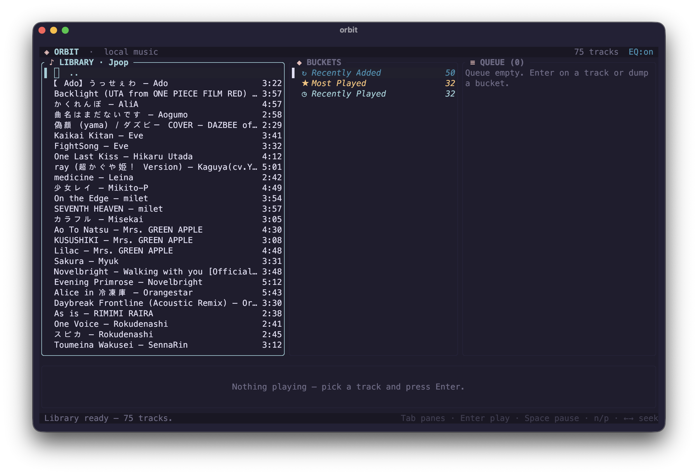</p>

Zen mode (`z`) — full-screen player with two visualizers you flip between with `v`:

<table>
  <tr>
    <td width="50%">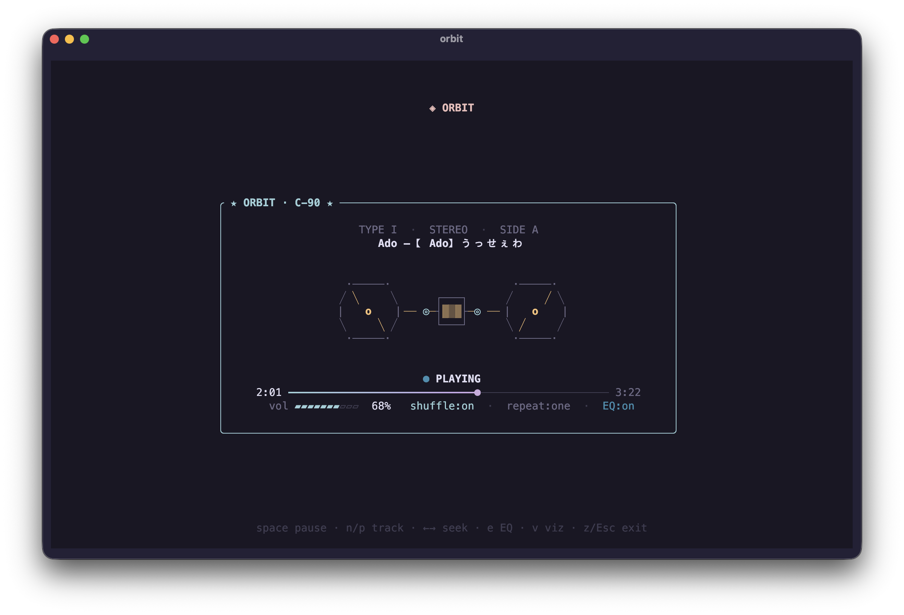</td>
    <td width="50%">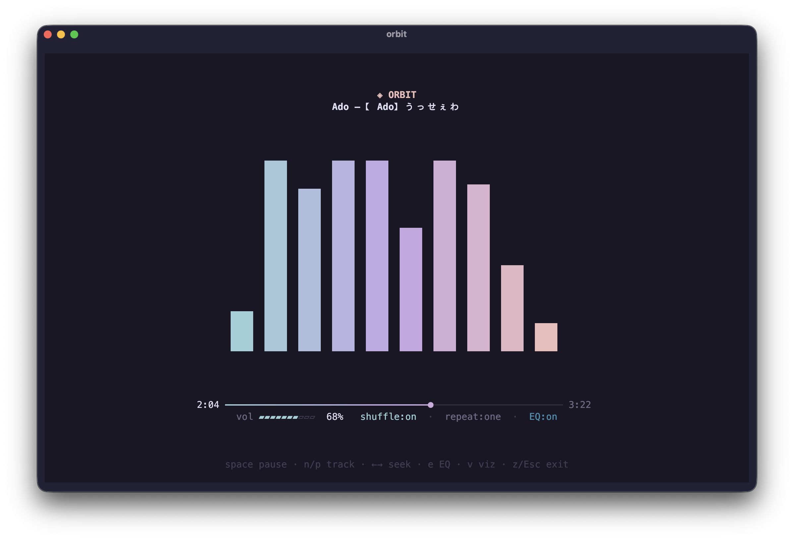</td>
  </tr>
</table>

The equalizer (`e`) and the About card (`i`):

<table>
  <tr>
    <td width="50%">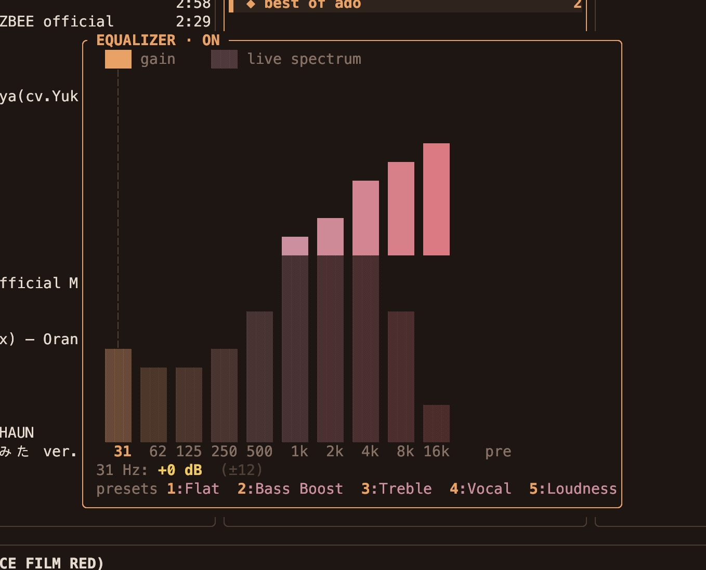</td>
    <td width="50%">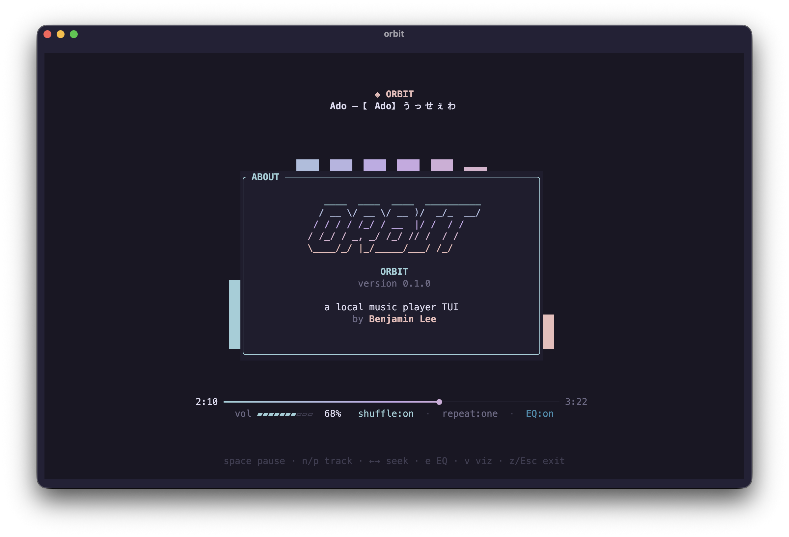</td>
  </tr>
</table>

### Themes

Ten built-in palettes — press `t` for a live picker:

<table>
  <tr>
    <td align="center">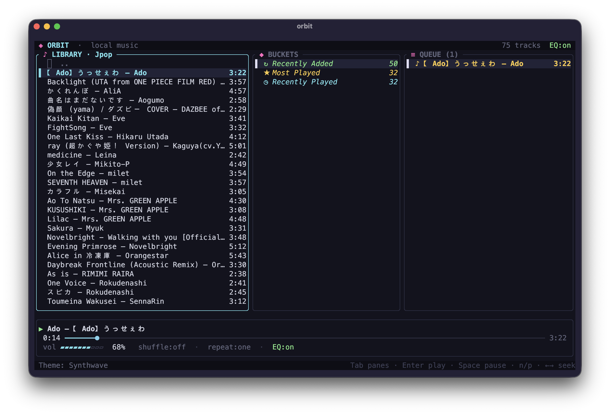<br>Synthwave</td>
    <td align="center">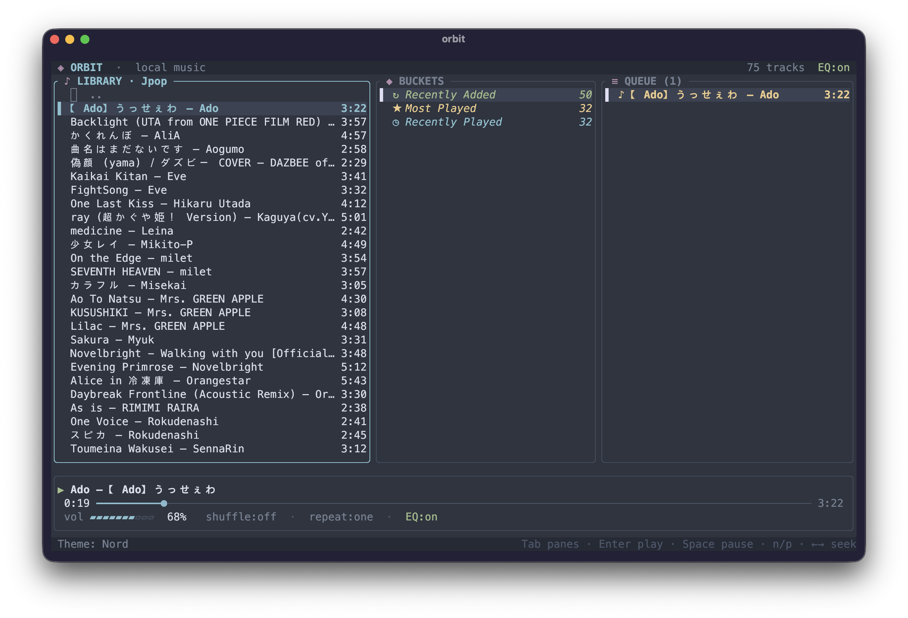<br>Nord</td>
    <td align="center">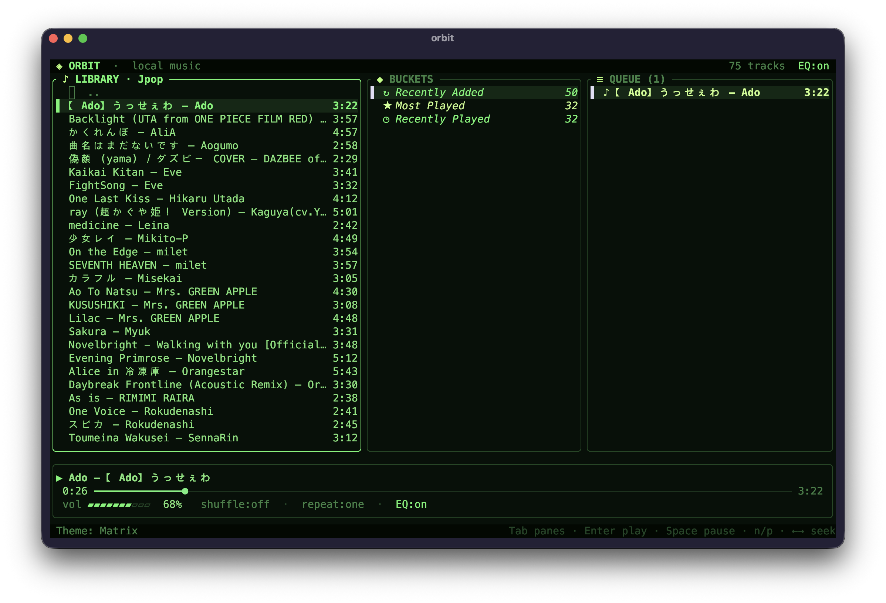<br>Matrix</td>
  </tr>
  <tr>
    <td align="center">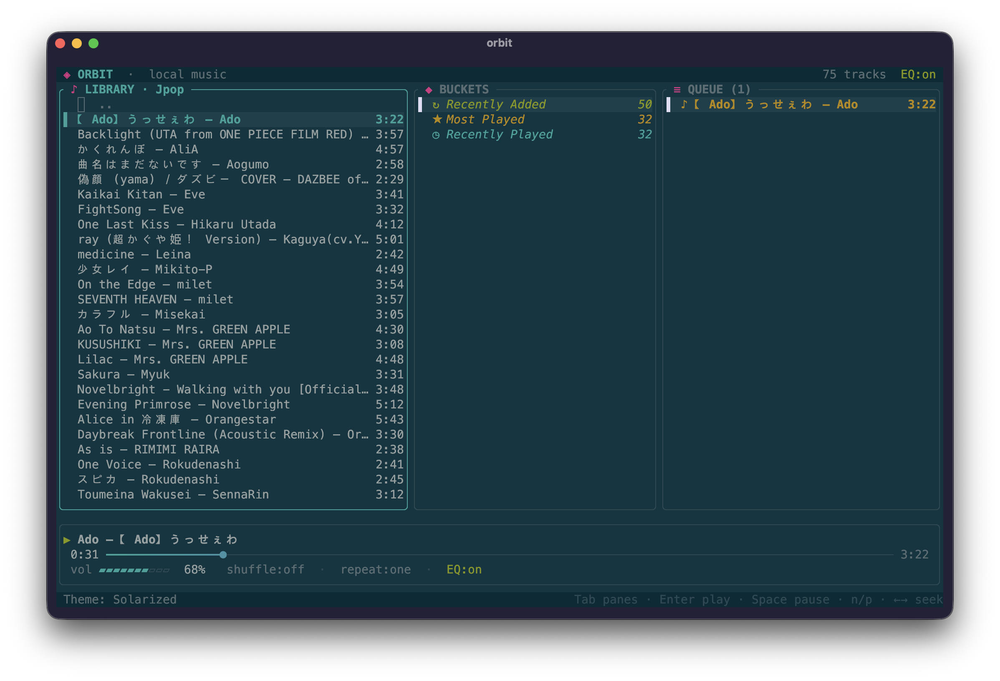<br>Solarized</td>
    <td align="center">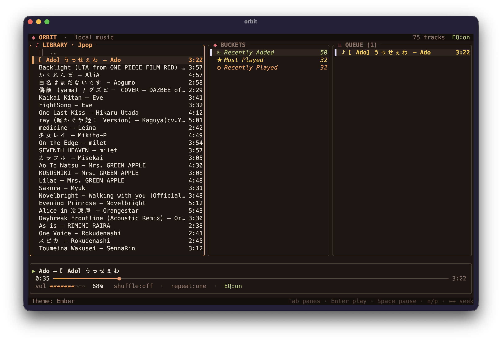<br>Ember</td>
    <td align="center">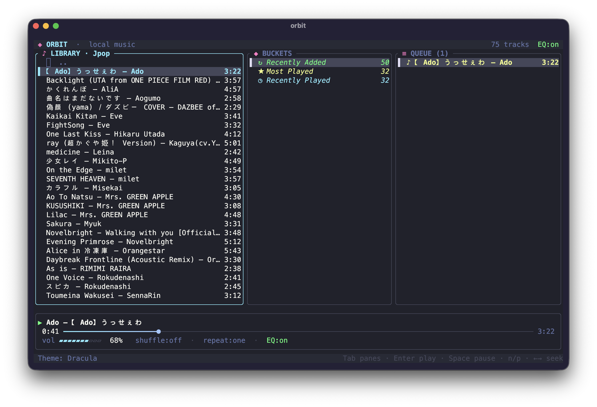<br>Dracula</td>
  </tr>
  <tr>
    <td align="center">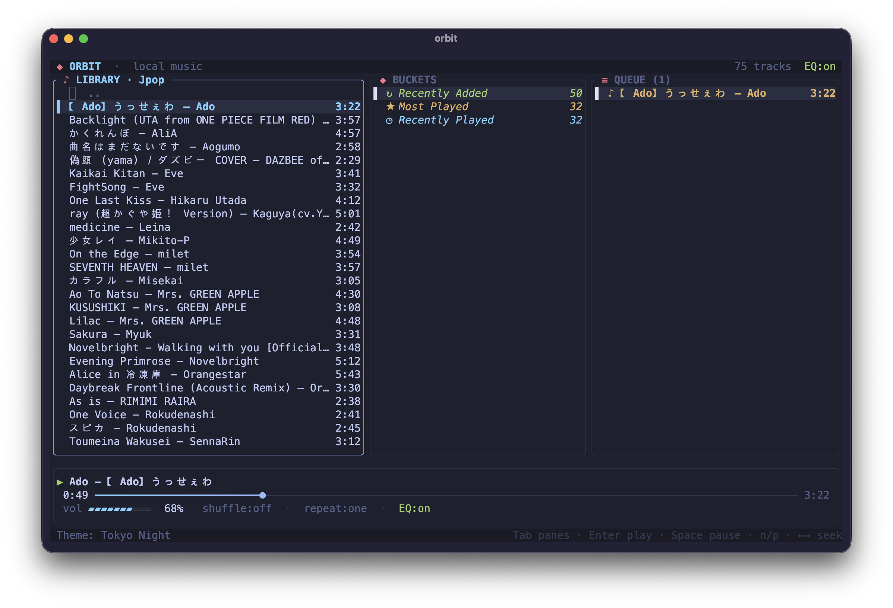<br>Tokyo Night</td>
    <td align="center">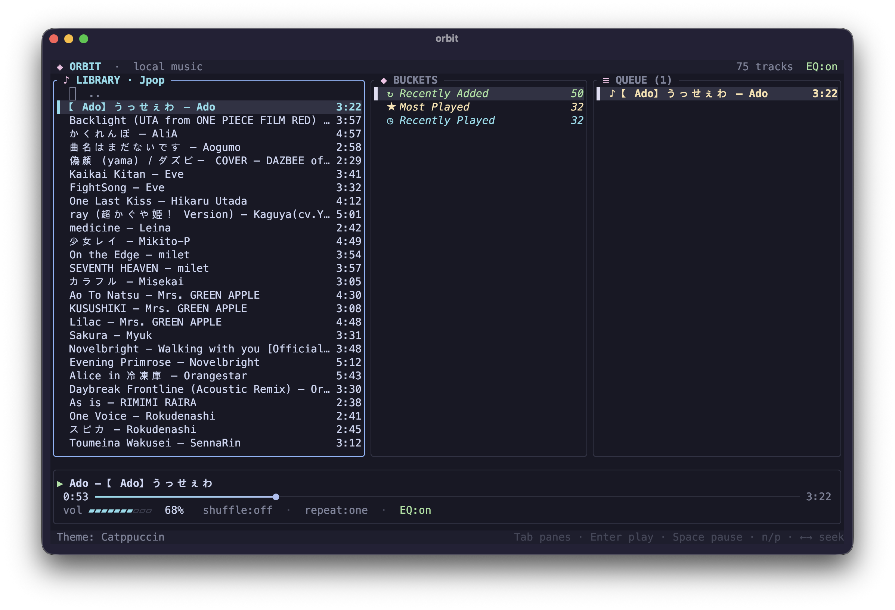<br>Catppuccin</td>
    <td align="center">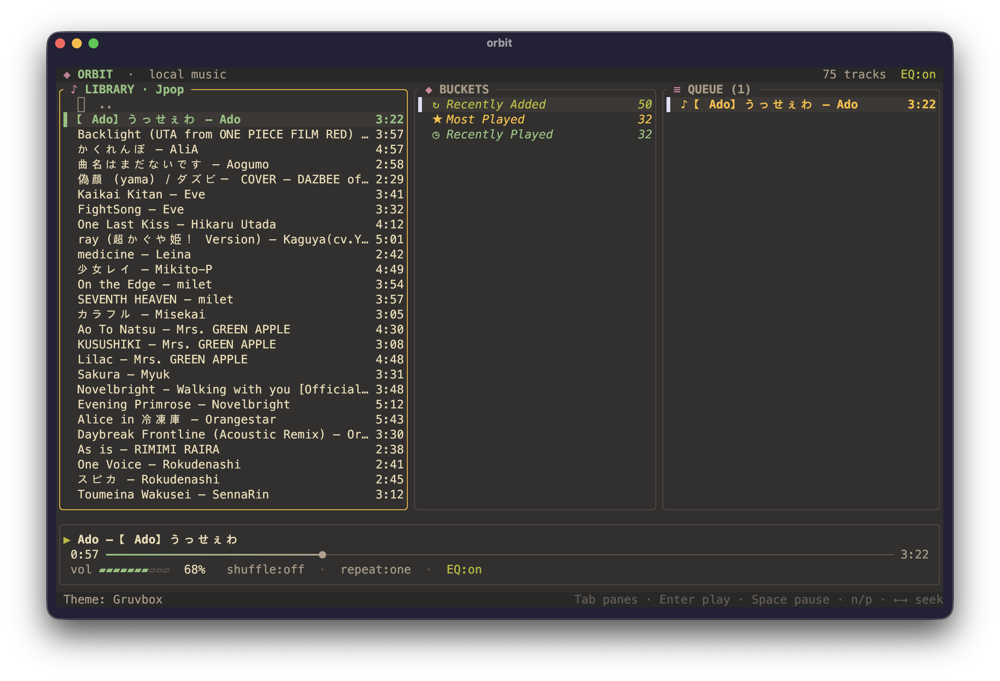<br>Gruvbox</td>
  </tr>
  <tr>
    <td align="center">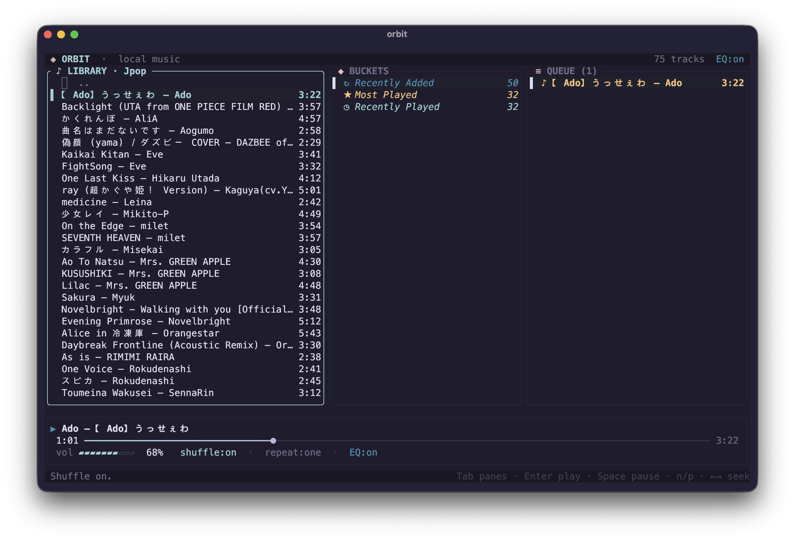<br>Rosé Pine</td>
    <td></td>
    <td></td>
  </tr>
</table>

## Keys

**Navigate** — `Tab` panes · `↑↓`/`j k` move · `Enter` open folder / play · `⌫` up · `/` search · `g`/`G` top/bottom

**Playback** — `Space` pause · `n`/`p` next/prev · `←→` seek · `+`/`-` volume · `s` shuffle · `r` repeat

**Buckets** — `b` new · `S` save queue · `a` add track · `o` open/edit · `d` dump · `x` delete/remove · `c` clear queue

**Library & EQ** — `A` folders · `R` rescan · `e` EQ · `E` EQ on/off · `z` zen · `v` visualizer · `t` theme · `i` about · `?` help · `q` quit

## Features

- **Buckets** — name playlists and `d`-dump them into the queue. `o` opens one to
  play, remove, reorder, or rename tracks; `S` saves the current queue as a bucket;
  each gets its own accent colour.

- **Smart buckets** — auto-filled *Recently Added*, *Most Played*, and *Recently
  Played*, built from play stats Orbit keeps as you listen.

- **Folder browsing** — the library navigates by folder (`Enter` / `⌫`); `/` searches
  everything; `A` opens a built-in folder picker to add or remove roots.

- **Equalizer** (`e`) — a real RBJ-biquad 10-band EQ drawn FabFilter-style: a response
  line over a live spectrum, with five presets and a pre-amp. Turns on the moment you
  touch it; settings persist.

- **Zen mode** (`z`) — full-screen player with synced `.lrc` lyrics and two
  visualizers (`v`): a live audio spectrum or an animated cassette deck.

- **Themes** (`t`) — ten palettes with a live preview picker, saved across sessions.

- **OS integration** — hardware media keys and the system Now Playing panel
  (Control Center / MPRIS / SMTC).

- **Safe & resilient** — confirmation prompts before destructive actions, and
  automatic recovery if the audio device changes mid-song.

## License

[MIT](LICENSE) © 2026 Benjamin Lee
