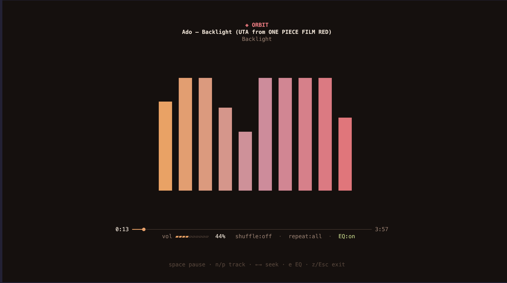
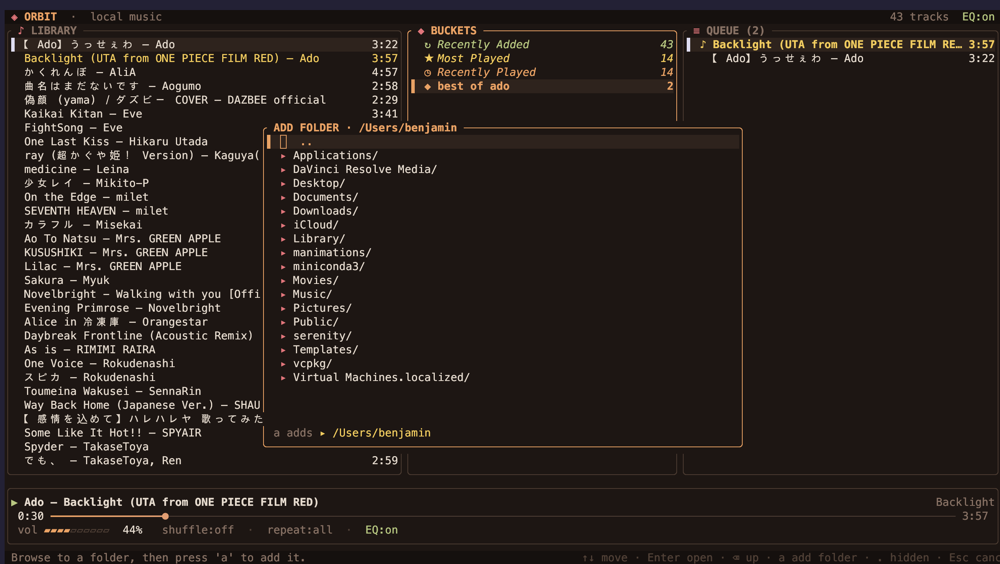

```
   ____  ____  ____  __________
  / __ \/ __ \/ __ )/  _/_  __/
 / / / / /_/ / __  |/ /  / /   
/ /_/ / _, _/ /_/ // /  / /    
\____/_/ |_/_____/___/ /_/     
```                               
# ◈ Orbit

A beautiful local **music player TUI** with **buckets** (playlists you dump into the
queue) and a real-time **10-band graphic equalizer**. Plays **MP3, FLAC, WAV, OGG,
M4A/MP4, and AAC**.

Built in Rust with [ratatui](https://ratatui.rs) for rendering and
[rodio](https://github.com/RustAudio/rodio) for playback. The EQ is a hand-rolled
cascade of RBJ peaking biquad filters applied to the decoded audio stream, with
band gains you can move live while music plays. Integrates with your OS media keys
and the system Now Playing panel.

## Screenshots

The three-pane overview — library, buckets (smart + your own), and the queue:


Zen mode (`z`) — full-screen player with a live spectrum analyzer driven by the audio:



The equalizer (`e`) — gain bars over the live spectrum, with presets:


The built-in folder browser for managing your library:



## Run

```sh
cargo run --release
```

On first launch Orbit adopts your **Music** folder as a library root if it exists.
Add more folders any time with `A`. Your library is cached so subsequent launches
are instant; press `R` to rescan.

## Platform support

Orbit runs on **macOS, Linux, and Windows**. Audio goes through `cpal` (CoreAudio /
ALSA / WASAPI) and OS media controls through `souvlaki`.

**Linux** needs a couple of system dev packages for audio (ALSA) and media controls
(D-Bus / MPRIS):

```sh
# Debian/Ubuntu
sudo apt install libasound2-dev libdbus-1-dev pkg-config
# Fedora
sudo dnf install alsa-lib-devel dbus-devel pkgconf-pkg-config
```

**macOS / Windows** need no extra packages — just a Rust toolchain.

Media-control integration per platform:
- **macOS** — Now Playing in Control Center / lock screen + media keys
- **Linux** — MPRIS (controllable from your desktop's media widgets; needs a D-Bus session)
- **Windows** — System Media Transport Controls (uses the console window)

If the OS controls can't initialise, Orbit just runs without them — playback is unaffected.

## Install globally

Build and install the binary so you can launch it from anywhere by typing `orbit`:

```sh
cargo install --path . --root ~/.local
```

This puts the binary at `~/.local/bin/orbit`. Make sure that directory is on your
`PATH` (it is on most setups); otherwise add to your shell profile:

```sh
export PATH="$HOME/.local/bin:$PATH"
```

`cargo install` copies a snapshot, so after changing the code re-run it with
`--force` to update the global command:

```sh
cargo install --path . --root ~/.local --force
```

Prefer it to track your latest build automatically? Symlink instead of installing
(re-pointed on every `cargo build --release`, but breaks if you move the project):

```sh
ln -sf "$(pwd)/target/release/orbit" ~/.local/bin/orbit
```

On **Windows**, just `cargo install --path .` — it lands in `%USERPROFILE%\.cargo\bin`,
which is already on your `PATH`, so you can run `orbit` from any terminal.

State lives under your platform data dir (`~/Library/Application Support/orbit`
on macOS): `config.json`, `buckets.json`, `library.json`.

## Layout

```
 ◈ ORBIT · local music                              1234 tracks  EQ:on
╭ ♪ LIBRARY ────────────╮╭ ◆ BUCKETS ──────╮╭ ≡ QUEUE (12) ───────────╮
│▌ Nightcall — Kavinsky ││▌ ◆ Late Night  3││  ♪ Track — Artist   3:21│
│  Resonance — Home     ││  ◆ Focus      18││  Track Two — Artist 4:05│
│  ...                  ││  ...            ││  ...                    │
╰───────────────────────╯╰─────────────────╯╰─────────────────────────╯
╭─────────────────────────────────────────────────────────────────────╮
│ ▶ Kavinsky — Nightcall                                       OutRun │
│ 1:23 ━━━━━━●────────────────────────────────────────────────── 4:18 │
│ vol ▰▰▰▰▰▰▱▱▱▱  80%   shuffle:on · repeat:all · EQ:on               │
╰─────────────────────────────────────────────────────────────────────╯
```

## Keys

**Navigate** — `Tab`/`⇧Tab` cycle panes · `↑↓`/`j k` move · `g`/`G` top/bottom · `/` search

**Playback** — `Enter` play track / dump bucket / play queue item · `Space` pause ·
`n`/`p` next/prev · `←→`/`h l` seek ∓5s · `+`/`-` volume · `s` shuffle · `r` repeat

**Buckets & queue** — `b` new bucket · `S` save queue as a bucket · `a` add track to a
bucket · `o` open bucket (edit) · `d`/`Enter` dump bucket → queue · `x` delete bucket /
remove queue item · `c` clear queue

**Media keys** — your keyboard's play/pause, next, and previous keys control Orbit,
and the current track shows in the system Now Playing panel (Control Center on macOS).

**Themes** — `t` cycles colour palettes (Synthwave · Nord · Matrix · Solarized · Ember), saved across sessions.

### Living buckets

Buckets are alive, not just static lists:
- **Smart buckets** (shown in italic with `↻ ★ ◷` icons) fill themselves — **Recently
  Added** (by file date), **Most Played**, and **Recently Played** (from play stats
  Orbit records as you listen). They can be dumped like any bucket but not deleted.
- **Save the queue as a bucket** with `S` — crystallize the current orbit.
- Each bucket gets its own **accent colour**.
- Focus the Buckets pane and it **splits top/bottom**, previewing the tracks in the
  highlighted bucket below the list.
- **Edit a bucket** with `o`: open it to play, **remove** tracks (`x`), **reorder**
  them (`K`/`J`), or **rename** the bucket (`r`). Smart buckets open read-only.

**Library & EQ** — `A` manage folders · `R` rescan · `e` open equalizer · `E` toggle EQ on/off · `z` zen mode · `?` help · `q` quit

### Manage folders (`A`)

A hub for your library roots: it lists every watched folder and lets you
`a` add one · `x` remove the selected one (rescans automatically) · `r` rescan ·
`Esc` close.

Adding opens a built-in directory explorer (musikcube-style) — no typing paths.
`↑↓` move · `Enter`/`→` open a folder · `⌫`/`←` go up · `.` toggle hidden folders ·
`a` add the highlighted folder (or the current one when `..` is selected) · `Esc`
back. A line at the bottom always shows exactly what `a` will add.

### Zen mode (`z`)

Hides every panel and shows only the player full-screen: a **live spectrum
analyzer** whose 10 bars are driven by the actual audio through band-pass filters
at the same frequencies as the EQ, and **synced lyrics** if a matching `.lrc`
sidecar exists (previous/current/next line, current highlighted).
`space`/`n`/`p`/`←→`/`e` all still work; `z` or `Esc` returns to the full view.

```
                      ◈ ORBIT

                Kavinsky — Nightcall
                      OutRun

              █        █              █
        █     █     █  █     █        █     █
        █  █  █  █  █  █  █  █  █  █  █  █  █
        █  █  █  █  █  █  █  █  █  █  █  █  █

        1:23 ━━━━━━●──────────────────── 4:18
         vol ▰▰▰▰▰▱▱▱ · shuffle · repeat · EQ
```

### Equalizer (`e`)

`←→` select band · `↑↓` adjust ∓1 dB · `x` enable/bypass · `f` flat reset ·
`1`–`5` presets (Flat, Bass Boost, Treble, Vocal, Loudness) · `Esc` close.

The EQ turns **on automatically** the moment you adjust a band or pick a preset, so
you don't have to remember to enable it. You can also toggle it from anywhere with
`E`, or with `x` inside the panel. The title bar shows `ON` / `BYPASSED`.

The EQ menu also shows a **live spectrum** of the currently playing audio,
column-aligned directly above each band's gain slider, so you can see exactly
which frequencies you're shaping. The rightmost slider is a **pre-amp** to tame
clipping when boosting many bands. Settings persist across sessions.
