```
   ____  ____  ____  __________
  / __ \/ __ \/ __ )/  _/_  __/
 / / / / /_/ / __  |/ /  / /   
/ /_/ / _, _/ /_/ // /  / /    
\____/_/ |_/_____/___/ /_/     
```

# ◈ Orbit

A beautiful **music player for your terminal** that makes a local library feel alive. Only the good stuff from streaming services, but the music is yours: a **radio of similar songs** picked by listening to the audio itself (fully offline, no accounts, nothing leaves your machine), gapless playback, a real 10-band EQ, synced lyrics, album art, and media keys.

Built in Rust with [ratatui](https://ratatui.rs) and [rodio](https://github.com/RustAudio/rodio). Runs on macOS and Linux.

<p align="center">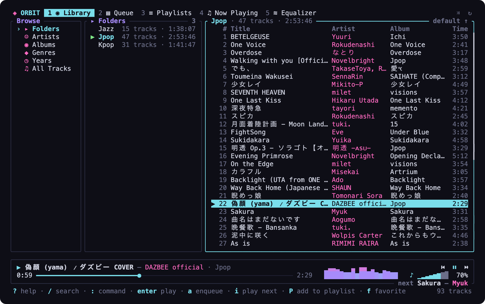</p>

- **Radio**: orbit fingerprints every track in the background (MFCC timbre plus spectral features) and plays what sounds alike. `M` starts a radio from the selected track, album or artist; the **Radio** smart playlist fills itself from what you've been playing.
- **Library**: browse by folder, artist, album, genre, year or all tracks, with nine sort orders. Tags are read from the files, and when they're missing orbit falls back to file names ("003 - King Gnu - 白日"). Metadata is cached, so startup is instant.
- **Search**: fzf-style fuzzy search across title, artist, album and file name. It has field filters (`a:yoasobi y:2019-`) and treats katakana and hiragana, full-width and half-width characters, and accented letters as equal.
- **Playback**:
  - gapless, with exact seeking (keys, `:seek 1:23`, `:seek 50%`, or clicking the progress bar)
  - shuffle (every track once per cycle), repeat off / all / one, stop after the current track
  - A-B loop, sleep timer, speed 0.25×–4×
  - volume up to 150 %, ReplayGain, short fades on pause and resume
- **10-band equalizer**: 14 presets plus custom curves. Changes apply live, without glitches.
- **Now Playing**: album art in truecolor half-blocks (embedded or `cover.jpg`, with a generated placeholder otherwise). Synced `.lrc` lyrics highlight along with the song, with per-track timing offsets. Lyric files in Shift_JIS, EUC-JP, EUC-KR and GBK are decoded correctly.
- **Visualizer**: six styles (bars, mirror, blocks, wave oscilloscope, stereo VU meters, and a cassette deck whose reels turn while it plays), fully tunable, plus a mini spectrum in the player bar.
- **Queue and playlists**:
  - play next, enqueue, reorder, save the queue as a playlist
  - M3U8 playlists (it also finds `.m3u` files in your music folders)
  - smart lists: Favorites, Most Played, Recently Played, Recently Added, Never Played, Radio
- **Download**: `w` (or `:download <url>`) fetches audio as mp3 with [yt-dlp](https://github.com/yt-dlp/yt-dlp), tags and cover art included, straight into your library.
- **Customizable**:
  - 32 themes plus per-slot color overrides
  - Nerd Font, Unicode or ASCII icons
  - 5 border styles, 5 progress-bar styles, 13 table columns, a compact mode
  - every key can be remapped, including to `:commands`
  - the config reloads live
- **Control from anywhere**: hardware media keys and the system Now Playing panel (Control Center, MPRIS), plus `orbit ctl next` and `orbit ctl status "{artist} - {title}"` for hotkeys and status bars. Desktop notifications, terminal title, mouse support, and session restore (queue, position, EQ, modes).

## Install

```sh
cargo install --git https://github.com/sihooleebd/orbit
```

Or from a local clone (re-run to update):

```sh
cargo install --path .          # puts `orbit` in ~/.cargo/bin
```

**Linux** also needs the ALSA and D-Bus development packages:

```sh
sudo apt install libasound2-dev libdbus-1-dev pkg-config        # Debian/Ubuntu
sudo dnf install alsa-lib-devel dbus-devel pkgconf-pkg-config   # Fedora
```

Formats: MP3, FLAC, WAV, AAC/M4A/MP4 and Ogg Vorbis are built in. If `ffmpeg` is installed, anything it can decode works too (Opus, ALAC, AIFF, WMA, …). Downloads need `yt-dlp` on your `PATH`.

## Quick start

```sh
orbit                          # scans ~/Music (change [library] dirs in the config)
orbit ~/Music/LocalFiles/Jpop  # play a folder right away
orbit --volume 40%             # start quieter
```

Inside orbit: `?` shows every key and command, `/` searches, `:` opens the command line. Tabs: `1` Library · `2` Queue · `3` Playlists · `4` Now Playing · `5` Equalizer. A big terminal window looks best. In VS Code, maximize the terminal panel or run "Terminal: Move Terminal into Editor Area".

## Screenshots

Now Playing (`4`) with album art and the visualizer; `v` flips through the styles, down to the cassette deck:

<table>
  <tr>
    <td width="50%">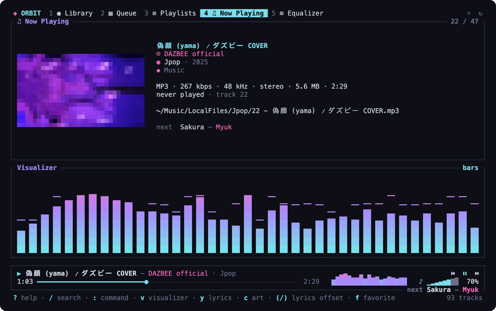</td>
    <td width="50%">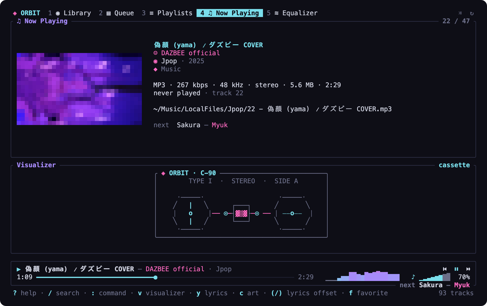</td>
  </tr>
</table>

A radio from one track (`M`), and fuzzy search (`/`) across Japanese, Korean and romanized names:

<table>
  <tr>
    <td width="50%">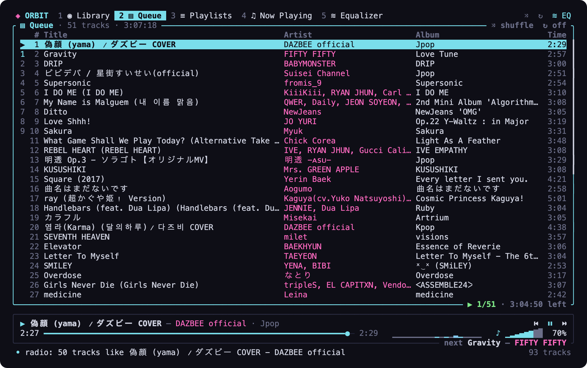</td>
    <td width="50%">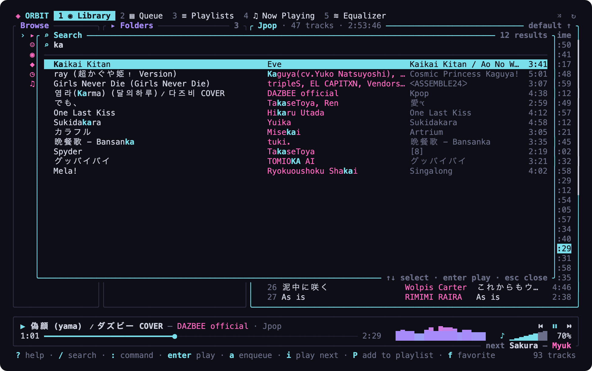</td>
  </tr>
</table>

The equalizer (`5`) and the help screen (`?`):

<table>
  <tr>
    <td width="50%">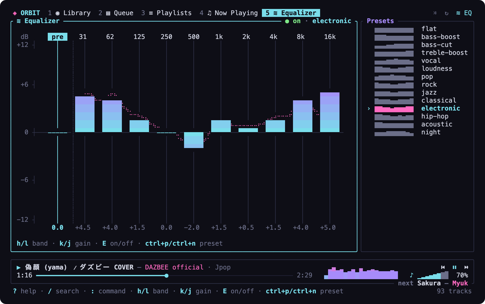</td>
    <td width="50%">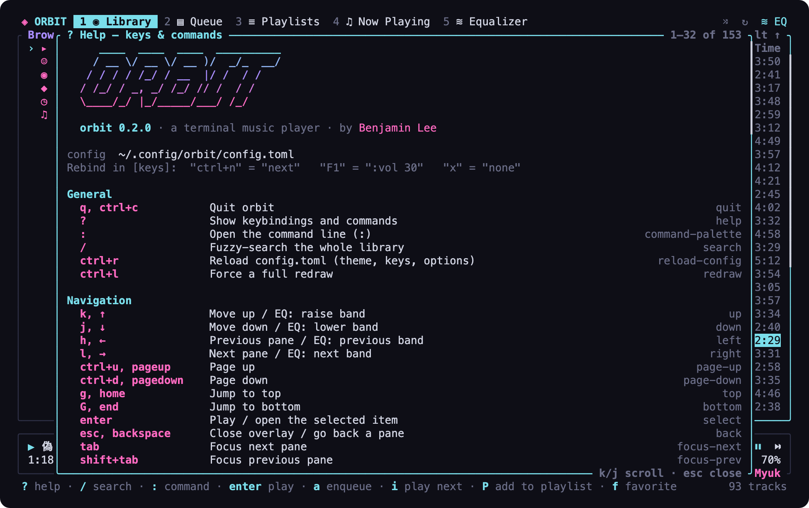</td>
  </tr>
</table>

### Themes

32 built in; `ctrl+t` cycles them live, `orbit --list-themes` shows them all:

<table>
  <tr>
    <td align="center" width="20%">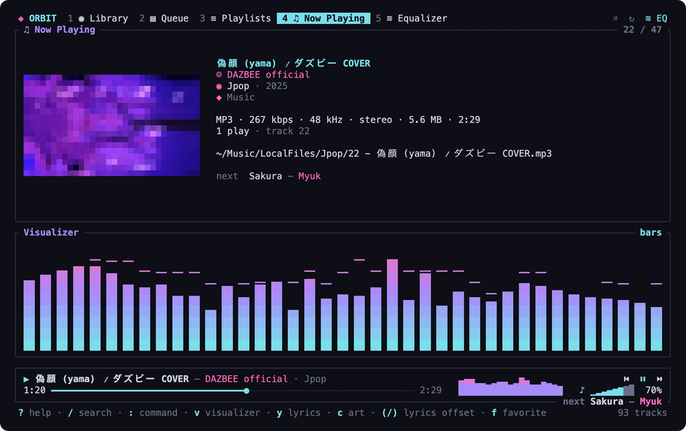<br><sub>orbit</sub></td>
    <td align="center" width="20%">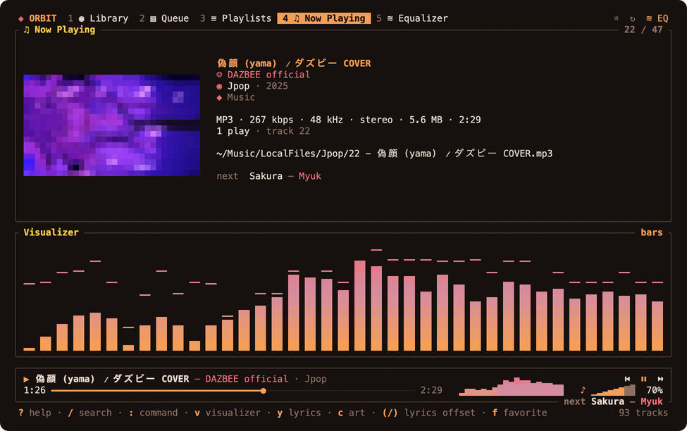<br><sub>ember</sub></td>
    <td align="center" width="20%">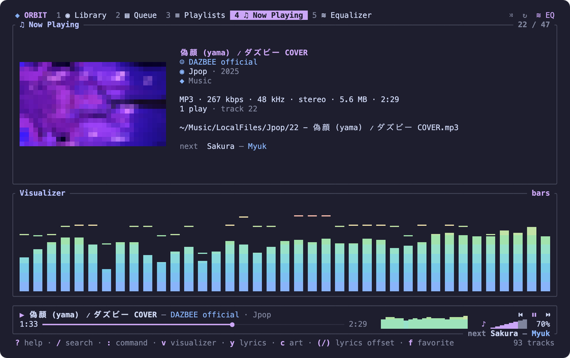<br><sub>catppuccin-mocha</sub></td>
    <td align="center" width="20%">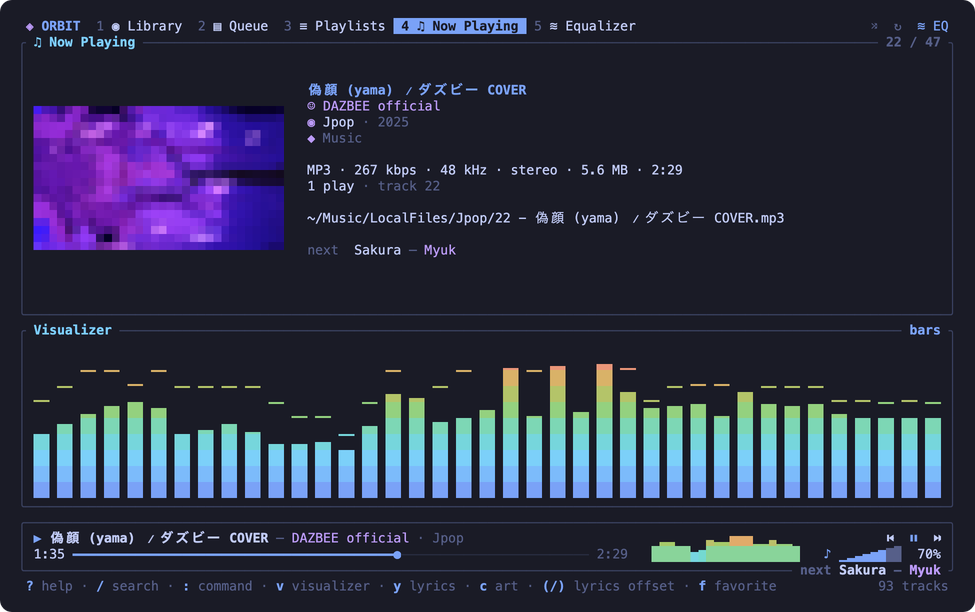<br><sub>tokyo-night</sub></td>
    <td align="center" width="20%">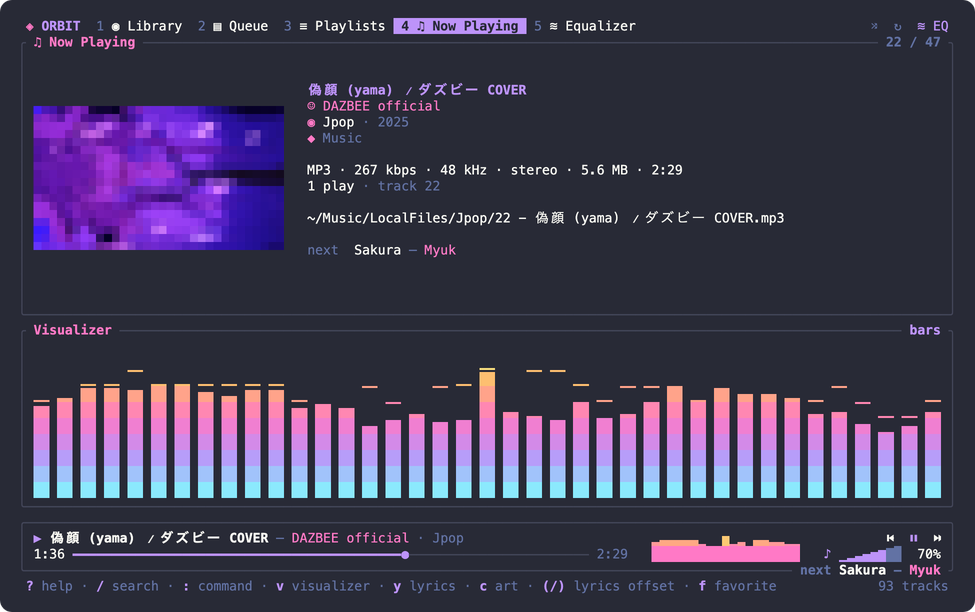<br><sub>dracula</sub></td>
  </tr>
  <tr>
    <td align="center" width="20%">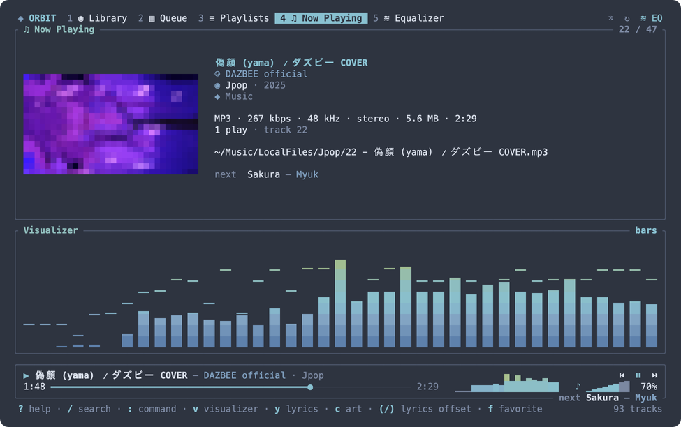<br><sub>nord</sub></td>
    <td align="center" width="20%">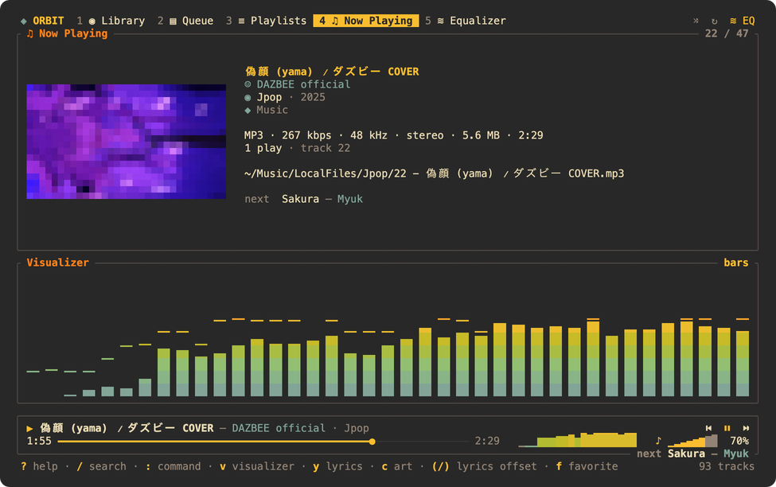<br><sub>gruvbox-dark</sub></td>
    <td align="center" width="20%">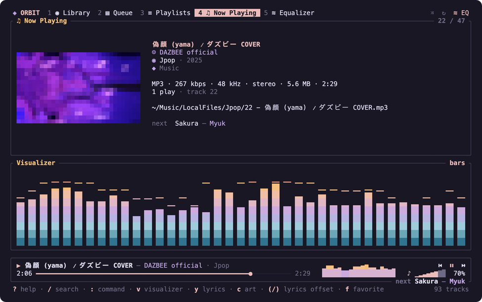<br><sub>rose-pine</sub></td>
    <td align="center" width="20%">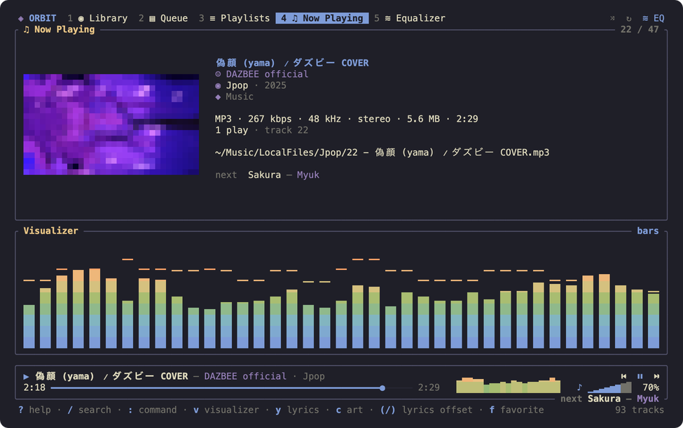<br><sub>kanagawa</sub></td>
    <td align="center" width="20%">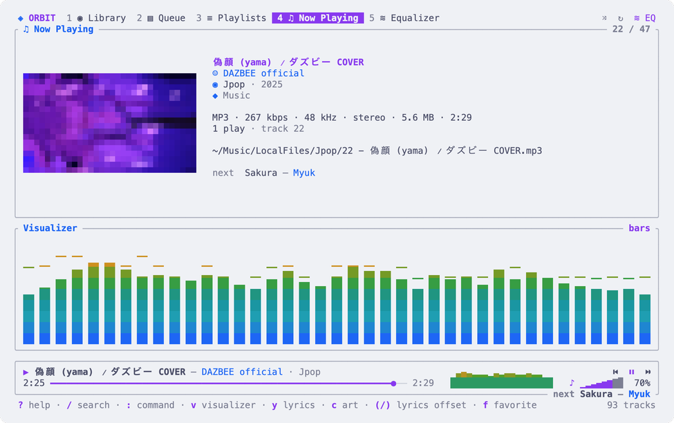<br><sub>catppuccin-latte</sub></td>
  </tr>
</table>

## Keys

These are the defaults. Change any of them in `[keys]`; `orbit keys` lists your current bindings.

| Key | Action |
|---|---|
| `q` `ctrl+c` | quit |
| `?` · `/` · `:` | help · search · command line |
| `1`–`5` · `[` `]` | switch tab · previous / next tab |
| `j` `k` `↑` `↓` · `g` `G` · `ctrl+d` `ctrl+u` | move · top / bottom · page down / up |
| `h` `l` `←` `→` · `tab` | switch pane (library: browse → groups → tracks) |
| `enter` · `esc` | play / open · back / close |
| `o` | jump to the playing track |
| `space` · `S` | play / pause · stop |
| `n` · `p` | next · previous (restarts the track if it's past 3 s) |
| `.` `,` (`shift+→` `shift+←`) · `>` `<` | seek ±5 s · ±30 s |
| `+` `-` · `m` | volume · mute |
| `}` `{` · `\` | faster / slower · normal speed |
| `s` · `r` · `x` | shuffle · repeat off/all/one · stop after this track |
| `B` · `Z` | A-B loop (set A, set B, clear) · sleep timer (15…90 min, end of track, off) |
| `a` · `i` · `A` · `M` | enqueue · play next · enqueue the whole list · radio from the selection |
| `d` · `K` `J` · `D` · `X` | remove · move up / down · clear queue · shuffle the queue in place |
| `f` · `P` · `N` · `R` · `W` | favorite · add to playlist · new playlist · rename · save queue as playlist |
| `t` `T` · `b` · `U` · `w` | sort / reverse · browse mode · rescan · download |
| `v` · `y` · `c` · `(` `)` | visualizer style · lyrics · album art · lyrics timing ∓250 ms |
| `E` · `ctrl+n` `ctrl+p` | EQ on/off · next / previous preset (in the EQ tab: `h` `l` pick a band, `j` `k` adjust it) |
| `ctrl+t` · `ctrl+e` · `ctrl+b` · `ctrl+v` | next theme · elapsed/remaining time · compact layout · mini visualizer |
| `ctrl+r` · `ctrl+l` | reload config · redraw |

Mouse:
- click a tab, row or button
- double-click to play
- scroll lists, the lyrics or the volume
- click the progress bar to seek
- drag the EQ sliders

## Commands

The same language works in the `:` prompt, in `orbit ctl …`, and in key bindings (`"F2" = ":vol 30"`). Run `orbit commands` for the full list.

```
play [file|folder|search text]    seek <+10|-10|1:23|50%>      vol <50|+5|-5|reset>     mute [on|off]
speed <1.25|+0.1|reset>           shuffle [on|off]             repeat [off|all|one]     stopafter [on|off]
sleep <30|1h30m|end|off>          loop <a|b|clear>             eq <on|off|PRESET|band N DB|preamp DB|reset>
theme [name]  vis [bars|mirror|blocks|wave|vu|cassette]  sort <key> [asc|desc]  view <folders|artists|…>
goto <tab>    add <path>…   clear   save <name>   load <name>   playlist new|delete|rename …   search <text>
rescan   radio   download <url> [folder]   lyrics offset <ms|+ms|-ms|reset>   fav [on|off]   status [format]
reload   help   quit
```

The command line also accepts aliases (`volume`, `v`, `unmute`, `skip`, `previous`, `dl`, `similar`, …) and completes with `tab`. It also completes theme, preset and playlist names, plus files and folders after `add` or `play ~/…`.

## Radio

The first time orbit sees your library it listens to each track in the background (the `≈` percentage in the top bar). Each track's fingerprint is cached, so this happens once per file.

- `M` on a track plays it, then the 50 tracks that sound most like it. On an album, artist or playlist, the radio follows the sound of all of it.
- `:radio` (or `orbit ctl radio`) starts one from the playing track and keeps it playing.
- The **Radio** smart playlist holds what sounds like your recent and most played tracks.

## Download

`w` opens `:download `; paste a URL (a video or a whole playlist) and press enter. orbit runs yt-dlp in the background (`⇣` in the top bar shows playlist progress), saves mp3s with tags and cover art into `Downloads` in your first music folder, and rescans. Name another folder with `:download <url> Lofi Mix`. Already-downloaded items are skipped.

## Search syntax

- Words separated by spaces must all match, in any order: `yoru yoasobi`.
- `'exact`, `^prefix`, `suffix$`, `!exclude`.
- Field filters: `t:` title, `a:` artist, `al:` album, `g:` genre, `p:` path, `y:2020`, `y:2010-2019`, `y:2015-`, `y:-1999`.
- Case, accents (é = e), full-width vs half-width, and katakana vs hiragana (ヨルシカ = よるしか) are ignored.
- File names are searched too, so romanized names find songs tagged in Japanese.
- In the results: `enter` plays now, `tab` enqueues, `alt+enter` plays next.

## Remote control and status bars

Media keys and the system Now Playing panel (macOS Control Center and lock screen, MPRIS on Linux) work out of the box. For everything else:

```sh
orbit ctl toggle            # bind these to global hotkeys (Raycast, skhd, Shortcuts, …)
orbit ctl next
orbit ctl vol +5
orbit ctl play ~/Music/LocalFiles/Kpop
orbit ctl status "{icon} {artist} - {title} [{position}/{duration}]"
```

Placeholders:
- from the track: `{title} {artist} {album} {album_artist} {year} {genre} {track} {disc} {duration} {file} {path} {folder} {format} {bitrate} {sample_rate} {channels}`
- from the player: `{state} {icon} {position} {remaining} {volume} {speed} {shuffle} {repeat} {queue}`
- fallbacks and width: `{year|n/a}` (fallback), `{title:.30}` (cut to 30 columns), `{volume:>3}` (right-align), and `{{` for a literal brace

A tmux status line, for example:

```tmux
set -g status-right '#(orbit ctl status "{icon} {title:.30} - {artist:.20}" 2>/dev/null)'
```

`orbit ctl` exits with status 1 when orbit isn't running or the command fails, so scripts can check it.

## Configuration

```sh
orbit --init-config     # writes ~/.config/orbit/config.toml, fully commented
orbit --print-config    # prints the default config
orbit check             # reports every problem in your config, with typo suggestions
orbit --list-themes     # themes with color swatches
```

Every option is optional. Change the file and press `ctrl+r` (or run `:reload`) to apply it without restarting. Some examples:

```toml
[library]
dirs = ["~/Music/LocalFiles"]
exclude = [".band/", ".logicx/", "/Voice Memos/"]   # default skips GarageBand / Logic projects

[ui]
theme = "catppuccin-mocha"
icons = "nerd"                   # needs a Nerd Font; "unicode" and "ascii" work everywhere
border = "rounded"               # rounded | plain | double | thick | none
progress = "gradient"            # line | block | segments | dots | gradient
columns = ["index", "title", "artist", "album", "year", "duration", "favorite"]
dynamic_accent = true            # tint the accent color from the album art

[playback]
on_select = "list"               # list | single | enqueue: what enter does on a track
replaygain = "album"
fade_ms = 150

[visualizer]
mode = "cassette"
bar_width = 1
peaks = true

[keys]
"ctrl+n" = "next"
"F2" = ":vol 30"                 # any :command
"x" = "none"                     # unbind

[colors]                         # override any theme slot
accent = "#ff79c6"
gradient = ["#50fa7b", "#f1fa8c", "#ff5555"]
```

Themes: orbit (the default: deep space, cyan to magenta), ember, default (your terminal's own colors), catppuccin-mocha, catppuccin-macchiato, catppuccin-frappe, catppuccin-latte, tokyo-night, tokyo-night-day, dracula, nord, gruvbox-dark, gruvbox-light, rose-pine, rose-pine-moon, rose-pine-dawn, kanagawa, everforest, one-dark, monokai, ayu-dark, ayu-light, github-dark, github-light, nightfox, solarized-dark, solarized-light, synthwave, sakura, matrix, mono, high-contrast.

EQ presets: flat, bass-boost, bass-cut, treble-boost, vocal, loudness, pop, rock, jazz, classical, electronic, hip-hop, acoustic, night.

## Lyrics and album art

orbit looks for lyrics in this order:
1. `Song.lrc` or `Song.txt` next to `Song.mp3`
2. the folders listed in `[lyrics] dirs` (`Artist - Title.lrc`)
3. lyrics embedded in the file (including SYLT synced frames)

Synced lyrics follow playback, and `(` `)` shift the timing for the current track (orbit remembers the offset). Lines that share a timestamp, such as a line and its translation, highlight together.

Album art comes from the file's embedded picture (front cover preferred), or from `cover`, `folder` or `front` `.jpg`/`.png` in the song's folder.

## Files

| Path | Contents |
|---|---|
| `~/.config/orbit/config.toml` | configuration |
| `~/.local/share/orbit/state.json` | session, play counts, favorites |
| `~/.local/share/orbit/playlists/*.m3u8` | your playlists |
| `~/.cache/orbit/library.json` | metadata cache (safe to delete) |
| `~/.cache/orbit/radio.json` | radio fingerprints (safe to delete; they're computed again) |

These follow `XDG_CONFIG_HOME`, `XDG_DATA_HOME` and `XDG_CACHE_HOME` if they're set. `orbit completions zsh` (or bash, fish) prints shell completions.

## License

[MIT](LICENSE) © 2026 Benjamin Lee
